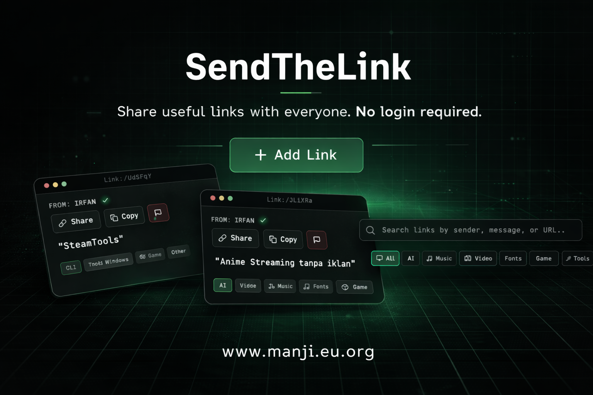

# 🔗 SendTheLink

[](https://sendthelink.vercel.app)

> **SendTheLink** is a free, secure, and modern link sharing platform with multi-layer security scanning, spam protection, and tag-based categorization. Share useful resources with anyone — no login required.

[](https://vercel.com/new/clone?repository-url=https://github.com/fanzyb/sendthelink)
[](LICENSE)
[](https://nextjs.org/)
[](https://firebase.google.com/)

**Live Demo:** [sendthelink.vercel.app](https://sendthelink.vercel.app)

**Keywords:** link sharing, resource sharing, free links, design assets, code resources, security scanning, anonymous sharing

---

## ✨ Features

### 🔒 **Security First**
- ✅ **Google reCAPTCHA v3** - Bot protection
- ✅ **VirusTotal Integration** - Scans links against 70+ antivirus engines
- ✅ **URLScan.io Integration** - Real-time URL security analysis
- ✅ **Content Moderation** - Pattern-based filtering (spam, adult, gambling)
- ✅ **XSS Protection** - All inputs sanitized
- ✅ **Security Headers** - CSP, X-Frame-Options, HSTS, etc.
- ✅ **Privacy-First Analytics** - Vercel Analytics (GDPR compliant, no cookies)

### ✓ **Verified User System**
- ✅ **Verified Badge** - Blue checkmark for trusted users (like Twitter/Meta)
- ✅ **Password Authentication** - Only verified users with correct password get the badge
- ✅ **Admin Control** - Manually verify/unverify users from admin dashboard

### 🎨 **Modern UI/UX**
- Terminal-inspired dark theme with subtle green grid background
- Consistent terminal window chrome (red/yellow/green top bar) across key views
- Responsive layout (mobile, tablet, desktop)
- Distinctive glowing terminal-style heading and mini terminal link cards
- Real-time link preview with OG metadata
- Anonymous posting option
- Centered toast notifications (mobile-friendly)
- **Tag-based categorization** (3D Assets, Design, Code, Tutorial, Tools, AI, Music, Video, Fonts, Game, Android, Windows, Other)

### 📊 **Admin Dashboard**
- Password-protected admin panel (`/admin`)
- View all links with security status
- Edit links: message, URL, tags, status, verified badge
- Delete links with confirmation
- Filter by: All, Reported, Flagged, Security Issues, Verified, Not Verified
- Search functionality
- Stats overview (Total, Reported, Flagged, Security Review, Verified)

### �️ **Security Scanning**
- **Async scanning** - Links are scanned in background after submission
- **Security Status**: Safe ✅ | Suspicious ⚠️ | Malicious 🚨 | Pending 🔄
- **Powered by**: VirusTotal & URLScan.io

### 🔗 **Link Details Page**
- Dedicated page for each shared link (`/link/[id]`)
- Large preview image
- Terminal-themed loading/error/modal states with window bar styling
- Share, Copy, Report buttons
- Full message and metadata

### 📢 **Report System**
- Users can report inappropriate content
- Auto-flag after multiple reports
- DMCA takedown request via email

---

## 🚀 Quick Start

### Prerequisites

- Node.js 18+ 
- Firebase account
- Google Cloud account (for reCAPTCHA)
- VirusTotal API key (free tier available)
- URLScan.io API key (free tier available)
- Vercel account (for deployment)

### 1. Clone Repository

```bash
git clone https://github.com/fanzyb/sendthelink.git
cd sendthelink
npm install
```

### 2. Set Up Firebase

1. Go to [Firebase Console](https://console.firebase.google.com/)
2. Create a new project
3. Enable Firestore Database
4. Get your Firebase config (Settings → Your apps)

### 3. Set Up APIs

Get API keys from:
- **reCAPTCHA v3** - [Google reCAPTCHA](https://www.google.com/recaptcha/)
- **VirusTotal** - [VirusTotal API](https://www.virustotal.com/gui/my-apikey)
- **URLScan.io** - [URLScan API](https://urlscan.io/user/profile/)

### 4. Configure Environment Variables

Create `.env.local`:

```bash
# Security APIs
VIRUSTOTAL_API_KEY=your_virustotal_api_key
URLSCAN_API_KEY=your_urlscan_api_key

# reCAPTCHA
NEXT_PUBLIC_RECAPTCHA_SITE_KEY=your_recaptcha_site_key
RECAPTCHA_SECRET_KEY=your_recaptcha_secret_key
RECAPTCHA_MIN_SCORE=0.5

# Admin
ADMIN_PASSWORD=your_secure_admin_password

# Verified User System
VERIFIED_USER_PASSWORD=your_secret_verification_password

# Configuration
FILTER_WHITELIST_MODE=false

# Firebase Configuration
NEXT_PUBLIC_FIREBASE_API_KEY=your_firebase_api_key
NEXT_PUBLIC_FIREBASE_AUTH_DOMAIN=your-project.firebaseapp.com
NEXT_PUBLIC_FIREBASE_PROJECT_ID=your-project-id
NEXT_PUBLIC_FIREBASE_STORAGE_BUCKET=your-project.firebasestorage.app
NEXT_PUBLIC_FIREBASE_MESSAGING_SENDER_ID=your_sender_id
NEXT_PUBLIC_FIREBASE_APP_ID=your_app_id
```

### 5. Run Development Server

```bash
npm run dev
```

Open [http://localhost:3000](http://localhost:3000)

---

## 📦 Deployment

### Deploy to Vercel (Recommended)

1. **Push to GitHub**
   ```bash
   git push origin main
   ```

2. **Import to Vercel**
   - Go to [vercel.com/new](https://vercel.com/new)
   - Import your repository
   - Add all environment variables
   - Deploy!

3. **Post-Deployment**
   - Add production domain to reCAPTCHA whitelist
   - Update Firebase Firestore rules

---

## 🛡️ Security

This project implements multiple layers of security:

- **VirusTotal Scanning** - Links checked against 70+ antivirus engines
- **URLScan.io Analysis** - Real-time URL security scanning
- **Input Sanitization** - XSS protection on all user inputs
- **Content Moderation** - Pattern-based filtering
- **HTTPS Only** - Enforced via HSTS headers
- **CSP** - Content Security Policy headers
- **Safe Firebase Rules** - Server-only writes, public reads

### Reporting Security Issues

Please report security vulnerabilities to: **fanzirfan@proton.me**

Do NOT open public issues for security vulnerabilities.

---

## 📂 Project Structure

```
sendthelink/
├── app/                    # Next.js App Router
│   ├── api/               # API Routes
│   │   ├── admin/        # Admin endpoints (auth, links)
│   │   ├── moderate/     # Content moderation
│   │   ├── preview/      # Link preview metadata
│   │   ├── report/       # Report system
│   │   ├── scan/         # Security scanning (VirusTotal, URLScan)
│   │   ├── submit/       # Secure submission
│   │   └── verify-captcha/ # reCAPTCHA verification
│   ├── admin/            # Admin dashboard
│   ├── link/[id]/        # Link details page
│   ├── globals.css       # Global styles (terminal theme + grid motif)
│   ├── layout.js         # Root layout
│   └── page.js           # Homepage
├── lib/                   # Utilities
│   └── firebase.js       # Firebase config
└── public/               # Static assets
```

---

## 🔧 Configuration

### Verified User System

To get the verified badge:
1. Set `VERIFIED_USER_PASSWORD` in your `.env.local`
2. When submitting a link, enter the password in "Verification Password" field
3. Your posts will show the blue ✓ Verified badge

Admin can also manually verify/unverify users from the Edit Link modal.

### Content Filtering

Edit `app/api/moderate/route.js` to customize:
- Blocked keywords
- Spam patterns
- Whitelisted domains (if `FILTER_WHITELIST_MODE=true`)

### Admin Auth

Access admin panel at `/admin` with `ADMIN_PASSWORD`.

---

## 🤝 Contributing

Contributions are welcome! Please:

1. Fork the repository
2. Create a feature branch (`git checkout -b feature/amazing-feature`)
3. Commit changes (`git commit -m 'Add amazing feature'`)
4. Push to branch (`git push origin feature/amazing-feature`)
5. Open a Pull Request

---

## 📝 License

This project is licensed under the **MIT License** - see [LICENSE](LICENSE) file.

---

## 🖼️ Branding Assets

- Open Graph image: `public/new-og.png`
- Favicon: `public/newfavico.png`

---

## 🙏 Acknowledgments

- [Next.js](https://nextjs.org/) - React framework
- [Firebase](https://firebase.google.com/) - Backend infrastructure
- [VirusTotal](https://www.virustotal.com/) - URL security scanning
- [URLScan.io](https://urlscan.io/) - URL analysis
- [Vercel](https://vercel.com/) - Hosting platform
- [reCAPTCHA](https://www.google.com/recaptcha/) - Bot protection
- [Vercel Analytics](https://vercel.com/analytics) - Privacy-friendly analytics

---

## 📧 Contact

- **Website:** [sendthelink.vercel.app](https://sendthelink.vercel.app)
- **Issues:** [GitHub Issues](https://github.com/fanzyb/sendthelink/issues)
- **Email:** fanzirfan@proton.me
- **DMCA:** dmca@manji.eu.org

---

## 🗺️ Roadmap

- [x] ~~Collections/categories~~ → **Tags system implemented!**
- [x] ~~Security scanning~~ → **VirusTotal & URLScan.io integrated!**
- [x] ~~Verified users~~ → **Verified badge system implemented!**
- [x] ~~Verified users~~ → **Verified badge system implemented!**
- [x] **Website Analytics** (Vercel Analytics)
- [ ] Link analytics (Per-link stats)
- [ ] Custom short URLs
- [ ] API for third-party integrations
- [ ] Mobile app (React Native)
- [ ] Browser extension

---

Made with ❤️ by [FanzYB](https://github.com/fanzyb)
